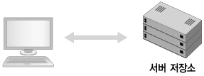
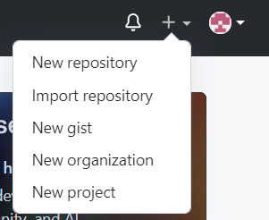
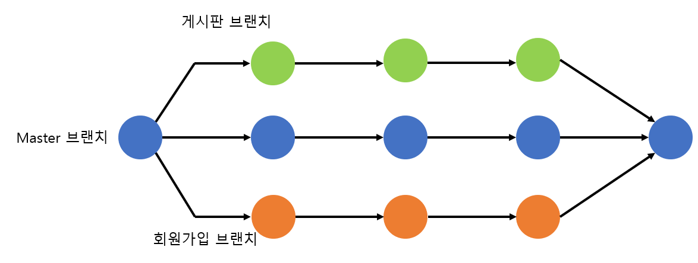
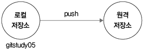
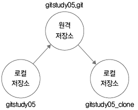

<h1>목록</h1>

- [5.1 서버](https://github.com/ossQB/5-qb/blob/main/51.md)
  - [*5.1.1 협업 저장소*](https://github.com/ossQB/5-qb/blob/main/51.md#511-%ED%98%91%EC%97%85-%EC%A0%80%EC%9E%A5%EC%86%8C)
  - [*5.1.2 연속된 작업*](https://github.com/ossQB/5-qb/blob/main/51.md#512-%EC%97%B0%EC%86%8D%EB%90%9C-%EC%9E%91%EC%97%85)
  - [*5.1.3 새 멤버*](https://github.com/ossQB/5-qb/blob/main/51.md#513-%EC%83%88-%EB%A9%A4%EB%B2%84)
- [5.2 깃허브 서버 준비](https://github.com/ossQB/5-qb/blob/main/52.md)
  - [*5.2.1 깃허브*](https://github.com/ossQB/5-qb/blob/main/52.md#521-%EA%B9%83%ED%97%88%EB%B8%8C) 
  - [*5.2.2 저장소 생성*](https://github.com/ossQB/5-qb/blob/main/52.md#522-%EC%A0%80%EC%9E%A5%EC%86%8C-%EC%83%9D%EC%84%B1)
- [5.3 깃허브 연동 및 원격 등록](https://github.com/ossQB/5-qb/blob/main/53.md)
  - [*5.3.1 로컬 저장소*](https://github.com/ossQB/5-qb/blob/main/53.md#531-%EB%A1%9C%EC%BB%AC-%EC%A0%80%EC%9E%A5%EC%86%8C)
  - [*5.3.2 프로토콜*](https://github.com/ossQB/5-qb/blob/main/53.md#532-%ED%94%84%EB%A1%9C%ED%86%A0%EC%BD%9C)
  - [*5.3.3 원격 저장소의 리모트 목록 관리*](https://github.com/ossQB/5-qb/blob/main/53.md#533-%EC%9B%90%EA%B2%A9-%EC%A0%80%EC%9E%A5%EC%86%8C%EC%9D%98-%EB%A6%AC%EB%AA%A8%ED%8A%B8-%EB%AA%A9%EB%A1%9D-%EA%B4%80%EB%A6%AC)
  - [*5.3.4 주소와 별칭*](https://github.com/ossQB/5-qb/blob/main/53.md#534-%EC%A3%BC%EC%86%8C%EC%99%80-%EB%B3%84%EC%B9%AD)
  - [*5.3.5 원격 저장소에 연결*](https://github.com/ossQB/5-qb/blob/main/53.md#535-%EC%9B%90%EA%B2%A9-%EC%A0%80%EC%9E%A5%EC%86%8C%EC%97%90-%EC%97%B0%EA%B2%B0)
  - [*5.3.6 소스트리에서 원격 브랜치*](https://github.com/ossQB/5-qb/blob/main/53.md#536-%EC%86%8C%EC%8A%A4%ED%8A%B8%EB%A6%AC%EC%97%90%EC%84%9C-%EC%9B%90%EA%B2%A9-%EB%B8%8C%EB%9E%9C%EC%B9%98)
  - [*5.3.7 별칭 이름 변경과 정보*](https://github.com/ossQB/5-qb/blob/main/53.md#537-%EB%B3%84%EC%B9%AD-%EC%9D%B4%EB%A6%84-%EB%B3%80%EA%B2%BD%EA%B3%BC-%EC%A0%95%EB%B3%B4)
  - [*5.3.8 원격 서버 삭제*](https://github.com/ossQB/5-qb/blob/main/53.md#538-%EC%9B%90%EA%B2%A9-%EC%84%9C%EB%B2%84-%EC%82%AD%EC%A0%9C)
- [5.4 서버 전송](https://github.com/ossQB/5-qb/blob/main/54.md)
  - [*5.4.1 push: 서버에 전송*](https://github.com/ossQB/5-qb/blob/main/54.md#541-push-%EC%84%9C%EB%B2%84%EC%97%90-%EC%A0%84%EC%86%A1)
- [5.5 자동으로 내려받기](https://github.com/ossQB/5-qb/blob/main/55.md)
  - [*5.5.1 clone: 복제*](https://github.com/ossQB/5-qb/blob/main/55.md#551-clone-%EB%B3%B5%EC%A0%9C)
  - [*5.5.2 pull: 서버에서 내려받기*](https://github.com/ossQB/5-qb/blob/main/55.md#552-pull-%EC%84%9C%EB%B2%84%EC%97%90%EC%84%9C-%EB%82%B4%EB%A0%A4%EB%B0%9B%EA%B8%B0)
- [5.6 수동으로 내려받기](https://github.com/ossQB/5-qb/blob/main/56.md)
  - [*5.6.1 자동 병합*](https://github.com/ossQB/5-qb/blob/main/56.md#561-%EC%9E%90%EB%8F%99-%EB%B3%91%ED%95%A9)
  - [*5.6.2 fetch: 가져오기*](https://github.com/ossQB/5-qb/blob/main/56.md#562-fetch-%EA%B0%80%EC%A0%B8%EC%98%A4%EA%B8%B0)
  - [*5.6.3 merge: 명령어로 수동 병합*](https://github.com/ossQB/5-qb/blob/main/56.md#563-merge-%EB%AA%85%EB%A0%B9%EC%96%B4%EB%A1%9C-%EC%88%98%EB%8F%99-%EB%B3%91%ED%95%A9)
- [5.7 순서](https://github.com/ossQB/5-qb/blob/main/57.md)
  - [*5.7.1 최신 상태*](https://github.com/ossQB/5-qb/blob/main/57.md#571-%EC%B5%9C%EC%8B%A0-%EC%83%81%ED%83%9C)
  - [*5.7.2 충돌 방지*](https://github.com/ossQB/5-qb/blob/main/57.md#572-%EC%B6%A9%EB%8F%8C-%EB%B0%A9%EC%A7%80)
- [5.8 정리](https://github.com/ossQB/5-qb/blob/main/58.md)

***
***

<h1>서버</h1>

<h2>5.1 서버 저장소</h2>

`원격(remote)저장소`라고도 하며, 로컬 저장소의 코드를 복제한 저장소

---

<h3>5.1.1 협업 저장소</h3>

점점 커지는 프로젝트 개발 규모에 맞춰 탄생한 협업 도구<br>
깃은 **온/오프라인 환경**을 모두 고려하여 **분산형 모델**을 선택함

---

<h3>5.1.2 연속된 작업</h3>

서버에 저장하는 것을 통해 다른 여러 컴퓨터에 코드를 **동기화**하고 연속된 작업 이어가기가 가능함<br>
서버 저장소는 여러 컴퓨터에 동일한 깃 저장소를 복제해주고, 작업한 결과물을 다시 서버로 통합해줌


---

<h3>5.1.3 새 멤버</h3>

새로운 멤버 참여시 지금까지 작업한 소스 코드의 **마지막 버전**을 공유해야 함.<br>
깃의 원격 저장소로 모든 구성원에게 코드의 최종 결과물 동기화가 가능

***
***

<h2>5.2 깃허브 서버 준비</h2>

<h3>5.2.1 깃허브</h3>

`Github` = 대표적인 깃호스팅 서비스 [GIT](http://github.com)<br>
<pre>
회원가입 > 이메일 주소 입력 > 본인 인증 과정 > 깃허브 서비스 이용
</pre>


---

<h3>5.2.2 저장소 생성</h3>

공개용 저장소 생성 방법
<pre>
로그인 > 대시보드의 New or + > New repository 클릭 > 저장소 소유자 선택 > Repository name에 저장소 이름 입력
*한 소유자 내의 같은 저장소 이름은 중복하여 생성할 수 없음
</pre>


***
***

<h2>5.3 깃허브 연동 및 원격 등록</h2>

<h3>5.3.1 로컬 저장소</h3>

로컬 저장소를 원격 저장소에 연결하는 방법

<pre>
1. 로컬 저장소 생성 > 초기화 > 저장소 소개 페이지 파일(REAMDE.md) 생성 > 추적등록, 커밋
2. 기존 저장소를 연결
</pre>

---

<h3>5.3.2 프로토콜</h3>

깃은 기본적으로 
`Local, HTTP, SSH, Git`
 네 종류의 전송 방식을 지원함<br>

- `Local` = 로컬 저장소를 서버로 이용할 때는 폴더 경로만 입력하면 됨<br>
    ```bash
    $ git remote add 원격저장소별칭 폴더경로
    ```
- `HTTP` = HTTP 방식의 프로토콜, 서버에 접속하려면 **로그인 절차**를 거쳐야 함<br>
- `SSH` = 주소에 **ssh://계정@주소** 형식으로 프로토콜 타입을 지정해야 함
    <pre>
    공개키와 개인키로 나뉘는 인증서를 만들어서 사용. 공개키는 서버에 등록하고 개인키는 로컬에 저장함
    익명 접속 X</pre>
- `Git` = 깃의 데몬 서비스를 위한 전용 프로토콜 방식 SSH와 유사하지만 인증 시스템이 없음 > **보안에 취약함**   

---

<h3>5.3.3 원격 저장소의 리모트 목록 관리</h3>   

- `remote`를 이용하면 현재 연결된 원격 저장소의 목록 확인 + 등록, 취소 등의 작업 가능<br>
- `help` 옵션으로 `remote` 명령어의 옵션 확인 가능.<br> 
- 주요 옵션

    ```bash
    $git remote = 연결된 원격 저장소의 이름(별칭) 출력
    $git remote ~v = 별칭과 URL 확인 가능
    ```

깃은 복수의 원격 저장소를 연결해 사용함<br>
`remote` 저장소가 여러 개일 경우 목록을 전부 출력하나, 저장소의 **권한 정보**까지는 알 수 없음

---

<h3>5.3.4 주소와 별칭</h3>

로컬 저장소에 원격 저장소(서버)를 등록하려면 **서버 주소**가 필요
<pre>
서버 주소 = 프로토콜 + 도메인 주소
</pre>
서버 저장소 생성시 폴더 경로 활용 가능

- **별칭** = 긴 서버 URL 문자열을 간략한 별칭으로 만들어 사용 가능<br>
    -**origin**: 대표적으로 사용되는 별칭, 목적에 따라 다른 이름 사용 가능

---

<h3>5.3.5 원격 저장소에 연결</h3>   

`add` 옵션 활용<br>

```bash
$git remote add 원격저장소별칭 원격저장소URL
```

인자 값으로 **원격 저장소 별칭과 URL**을 같이 입력해야 함 (별칭은 중복 선택 불가)<br>
원격 저장소가 연결되면 `fetch`와 `push` 두 주소를 출력<br>
<pre>
fetch = 서버에서 가지고 오는 동작<br>
push = 서버로 전송하는 동작
</pre>

---

<h3>5.3.6 소스트리에서 원격 브랜치</h3>   

원격 저장소를 등록하면 기존 master 브랜치와 다른 또 하나의 브랜치가 표시됨.(자동 생성)
<pre>
master = 현재 로컬 저장소
local/master = 별칭/브랜치 = 원격 저장소의 브랜치를 의미함 (로컬 저장소와 서버 저장소를 구분하여 표시함 - 동기화 시점 확인)
</pre>



---

<h3>5.3.7 별칭 이름 변경과 정보</h3>

별칭은 **긴 문자열의 서버 주소**를 대체함.<br>
별칭 관련 옵션

```bash
$git remote rename 변경전 변경후 = 별칭 이름을 다시 변경 가능
$git remote show 원격저장소별칭 = 원격 저장소의 상세한 정보 확인
```

---

<h3>5.3.8 원격 서버 삭제</h3>

깃을 사용하다보면 임시 등록된 원격 저장소들도 있는데, `rm` 옵션으로 삭제 가능

```bash
$git remote rm 원격저장소별칭
```

***
***

<h2>5.4 서버 전송</h2>

<h3>5.4.1 push: 서버에 전송</h3>

`push` = 원격 저장소로 커밋된 파일들을 업로드 하는 동작<br>

```bash
$git push 원격저장소별칭 브랜치 이름
```

`push`를 통해 자신의 로컬 저장소를 백업하는 용도로도 사용 가능   



***
***

<h2>5.5 자동으로 내려받기</h2>

<h3>5.5.1 clone: 복제</h3>

`clone` = 초기화 `init` 명령어 외에 원격 서버 접속에 필요한 추가 설정을 **자동으로 수행**<br>
- 서버와의 연결 설정을 마치고 서버 안의 모든 커밋된 코드 이력들을 한 번에 내려받음<br>

로컬 저장소 생성 이후 서버에서 코드를 처음 내려받을 때는 `clone` 명령어를 사용하면 편리



---

<h3>5.5.2 pull: 서버에서 내려받기</h3>

복제 후 원격 저장소의 갱신된 내용을 **추가로 내려받을 때** `pull` 명령어를 사용함

```bash
$git pull
```

로컬 저장소보다 **최신으로 갱신된** 원격 저장소의 커밋 정보를 현재 로컬 저장소로 내려받음

***
***

<h2>5.6 수동으로 내려받기</h2>

<h3>5.6.1 자동 병합</h3>

- `pull`은 원격 서버에 현재 커밋보다 **더 최신인** 커밋 정보가 있을 때 내려받음    
  - 내려 받은 커밋 정보는 **임시 영역에 저장**됨 (원격 저장소를 위한 전용 임시 브랜치가 따로 존재)
- 1인 개발은 `pull`만으로도 편리하지만 여러 개발자와의 협업 중에는 `pull`이 가끔 자동으로 브랜치 병합을 하지 못함
  - 자동 병합 실패시 `fetch` 방식 사용 가능

---

<h3>5.6.2 fetch: 가져오기</h3>

`fetch` = 원격 저장소에서 코드를 수동으로 내려받는 작업<br>
- 현재 브랜치와 자동 병합은 하지 않음

```bash
$git fetch 원격저장소URL
```

* `fetch`는 **서버/master 형태**의 새로운 master 임시 브랜치를 하나 더 생성
  * 생성된 임시 브랜치에는 커밋을 할 수 없음

---

<h3>5.6.3 merge 명령어로 수동 병합</h3>

`merge` = `fetch`로 내려받은 커밋을 로컬 저장소에 적용시키는 병합 명령

```bash
$git merge 원격저장소별칭/브랜치이름
```

***
***

<h2>5.7 순서</h2>

<h3>5.7.1 최신 상태</h3> 

- 원격 저장소에 `push`하기 위해서는 자신의 로컬 저장소를 최신 상태로 유지해야함
- `commit`이 순차적이지 않을 때 깃은 푸시 동작을 거부
  -  `pull` / `fetch` 작업으로 로컬 저장소 갱신 필요

---

<h3>5.7.2 충돌 방지</h3>

+ `git`이 최신 상태에서만 푸시를 허용하는 이유는 **충돌 방지** 때문
    + `pull`은 내려받은 커밋을 현재 브랜치로 자동 병합하는데, 이 때 커밋 내용이 순차적이지 않으면 병합 과정에서 **충돌 발생**
        + `git`은 이 충돌을 더 쉽게 해결할 수 있도록 푸시할 때 커밋의 순차적 기록을 확인
            + `push`를 사용하기 전에 새로운 커밋 갱신이 없는지 `pull`을 사용해 지속적 확인이 필요

**권장 순서**
<pre>
pull > coding > commit > pull > push
</pre>

- 소스트리 사용 시 `push` 이전에 `push` 버튼 위의 조그마한 숫자로 로컬 / 원격 저장소 사이의 **커밋 차이점**을 쉽게 확인 가능
- **인증 정보 캐시** = 원격 저장소의 접속을 위한 **아이디 / 비밀번호**를 임시적으로 보관하는 기능 (바로 접속이 가능함)

```bash
$git config --global credential.helper cache
```

- **원격 저장소 원리** = 깃을 원격 저장소에 연결하면 './git/config' 파일 안에 리모트 연결에 대한 **설정 정보**가 자동으로 추가됨

***
***

<h2>5.8 정리</h2>

- `git` 은 코드 이력 관리 뿐 아닌 다른 개발자와의 협업 도구로도 많이 사용함 
    - 다른 개발자와의 협업을 위해 공유 매개체의 역할을 수행할 서버가 필요해짐
        - `git`은 다양한 종류의 서버를 지원하는데, `git server`를 직접 만들거나 인기 있는 `git hosting service`를 이용 가능
+ `git`은 서버 역할을 수행하는 원격 저장소와 커밋 정보들을 주고받음
    + 이러한 원격 저장소 기능을 통해 `git`은 오픈 소스 활성화에 많은 기여를 하는 협업 툴이 되었음

