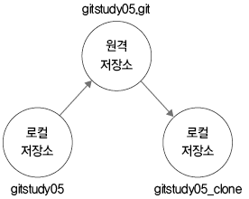

<h2>5.5 자동으로 내려받기</h2>

<h3>5.5.1 clone: 복제</h3>

`clone` = 저장소 초기화 명령어인 `init` 외에 원격 서버 접속에 필요한 추가 설정을 **자동으로 수행**<br>
> 서버와의 연결 설정을 마치고 서버 안의 모든 커밋된 코드 이력들을 한 번에 내려받음<br>

로컬 저장소 생성 이후 서버에서 코드를 처음 내려받을 때는 `clone` 명령어를 사용하면 편리



---

<h3>5.5.2 pull: 서버에서 내려받기</h3>

복제 후 원격 저장소의 갱신된 내용을 **추가로 내려받을 때** `pull` 명령어를 사용함

```bash
$ git pull
```

로컬 저장소보다 **최신으로 갱신된** 원격 저장소의 커밋 정보를 현재 로컬 저장소로 내려받음
