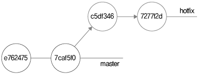
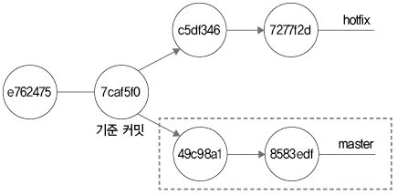
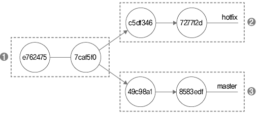
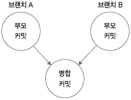

<h1>8.3 3-way 병합</h1>

`3-way` = 좀 더 복잡한 병합을 처리하는 방식. 여러 개발자와 협업시 주로 사용

<h2>8.3.1 브랜치 생성과 수정 작업</h2>

> <h6> - 예시로 사용하기 위해 생성한 hotfix 브랜치의 파일 수정 및 커밋 로그</h6>
> 
> 

<h2>8.3.2 마스터 변경</h2>

> <h6> - 기준 커밋에서 추가 커밋 이후 분기 </h6>
>
> 
> - `master` 브랜치로 돌아가 **추가로 커밋**했을 때의 형태
> - `master` 브랜치의 **최신 커밋을 기준**으로 2가지로 갈라지는 모습 확인 가능

<h2>8.3.3 공통 조상</h2>

> 앞선 실습의 브랜치처럼 브랜치 모양이 갈라지면 `Fast-Forward` 알고리즘으로 **병합이 불가능**함
>> 이럴 때 사용하는 알고리즘이 `3-way` 알고리즘임
>
> **공통 조상 커밋** = 두 브랜치를 병합하기 위해 찾아야하는 **기준이 되는 공통 커밋**
>> **공통 조상 커밋을 포함하는 브랜치 + 새로운 2개의 브랜치**로 구성되어 있어 `3-way` 병합이라 함
>
> 
> - 깃은 `3-way` 병합 시 공통 조상 커밋을 자동으로 찾아줌

<h2>8.3.4 병합 커밋</h2>

> **병합** = 각 브랜치에서 **독립적으로 작업된 소스를 파일 하나로 결합**함
>> - 브랜치별로 **각각 작업한 내용을 병합**하는 과정은 힘들고 어려움
> 깃은 이 작업을 쉽게 처리해 **공통 조상 커밋을 기준**으로 병합해줌
>> - 병합을 성공적으로 완료한 후 **새로운 커밋(병합 커밋)을 생성**함
>> - 병합 커밋은 **부모 커밋이 2개**라는 특징을 지님
>
> 

<h2>8.3.5 병합 메시지</h2>

> `3-way` 병합은 `Fast-Foward`와 다르게 **병합 메시지**를 필수로 함
>> - *"Merge branch 'hotfix'"*이라고 **커밋 메시지가 자동 삽입**됨
>> - 깃은 두 브랜치를 병합한 후 새로운 커밋을 하는 과정에서 **동시에 메시지를 자동 생성**함
> **직접 병합 메시지를 설정**하는 명령어 `-edit` 옵션

```bash
$ git merge 브랜치명 -edit #병합 메시지를 입력할 수 있는 vi 에디터 창이 열림
```