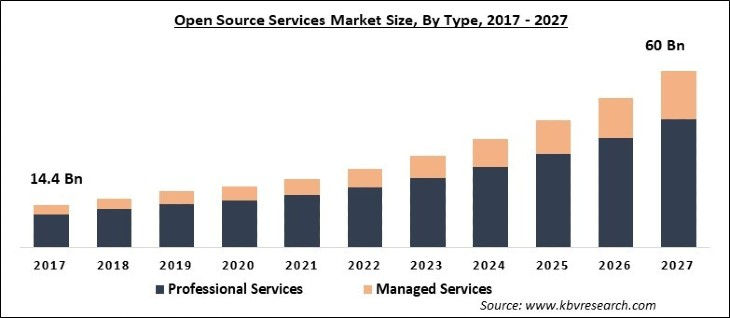

<h1>3. OSS의 현재</h1>

---

<h2>3-1. OSS 시장 현황</h2>

 **2017 - 2027(예상) 국제 OSS 시장 규모
 
>
> <h6>OSS 시장은 개발 이후로 꾸준한 성장세이며, 전문가들의 의견에 의하면 2027년까지도 급성장할 것으로 추정된다.</h6>

*OSS의 시장 가치는 2022년 현재 해외 시장의 경우 약 320억 달러, 국내 시장의 경우 약 4700억 원의 규모에 도달할 것으로 보고 있다.*

> DB 전문 리뷰 사이트인 DB엔진<DBEngines.com>에 따르면
> OSS는 2022년 1월에 이미 상업 라이선스의 점유율을 넘음

아이디어 공유 사회 속에서 OSS의 '경험'이나 '데이터' 등의 가치는 점점 늘어날 것

<h2>3-2. 주요 OSS 사례</h2>

<h3>1. Python</h3>

> 1991년 발표된 프로그래밍 언어 
> 몇몇 예외를 제외하고서는 대부분 라이브러리를 오픈 소스로 지원함 
> 최근 상승세인 대표적인 프로그래밍 언어임

<h3>2. HTML</h3>

> 대표적인 마크업 언어 
> 인터넷에서 우클릭을 통한 HTML의 소스 보기가 가능 
> 현재는 HTML5가 웹 표준으로 사용됨

<h3>3. 리눅스</h3>

> 유닉스에서 파생된 운영체제 
> 다양한 개발자들이 기능, 성능을 추가 가능한 '대중성'과 '편의성'을 갖춤 
> 다양한 배포판 (레드햇, 우분투 등) 존재

<h3>4. Git</h3>

> 리누스 토발스가 개발한 분산형 버전 관리 프로그램 
> 오픈 소스 시대에 최적화된 저장소로 평가됨 
> Git을 호스팅하는 GitHub는 현재 오픈 소스의 중심지임